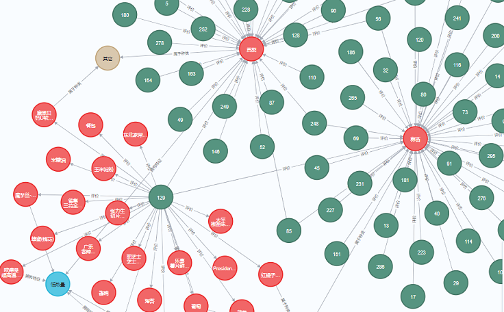
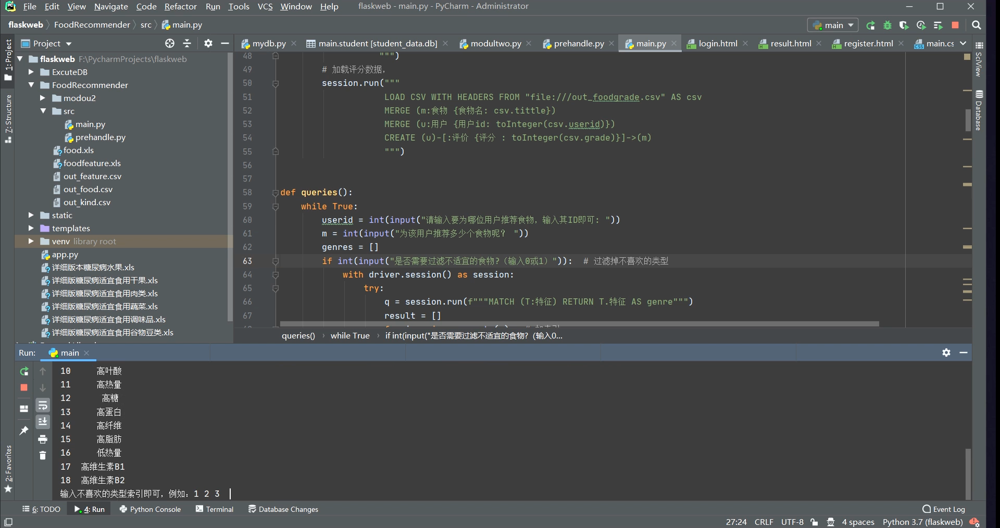

## 计算机毕业设计Python+大模型膳食推荐系统 知识图谱 面向慢性病群体的膳食推荐系统  健康食谱推荐系统 机器学习 深度学习 Python爬虫 大数据毕业设计

## 要求
### 源码有偿！一套(论文 PPT 源码+sql脚本+教程)

### 
### 加好友前帮忙start一下，并备注github有偿纯python膳食推荐
### 我的QQ号是2827724252或者798059319或者 1679232425或者微信:bysj2023nb

# 

### 加qq好友说明（被部分 网友整得心力交瘁）：
    1.加好友务必按照格式备注
    2.避免浪费各自的时间！
    3.当“客服”不容易，repo 主是体面人，不爆粗，性格好，文明人。

## 介绍
### 1.数据获取

知识图谱数据层的构建需要具体的实体，在模式层的约束下需要对数据进行补充。由于没有适合协同过滤算法的公开数据集，本次数据的获取主要来源于薄荷网与唤醒食物网页。

### 2.构建知识图谱

契合算法的模式层在敲定之后，选择用Neo4j知识图谱进行数据的存储。使用Python对数据库进行连接创建，首先将Neo4j数据库driver导入当前环境变量中来，使用CQL语句对数据库进行创建，读取上一小节处理好的三个文件，利用Create与merge关键词创建节点、关系。形成了<食物，属于，种类>，<食物，拥有，特征>，<用户，评价，食物>等三元组

### 3.推荐算法

每个用户都具有一个ID，前端初始化时会将ID传递给服务端，服务端开始访问知识图谱服务，查询该用户的评价关系图谱，经过相似度算法处理，得到用户相似度，可以构建关于该用户的相似关系图谱，由相似关系图谱对该用户做出食物推荐，得出初始推荐列表，然后根据用户的特征过滤掉该用户不宜食用的食物即可得到成熟推荐列表

## 演示视频
https://www.bilibili.com/video/BV1T3DhYeEjp/?spm_id_from=333.999.0.0

## 演示截图

